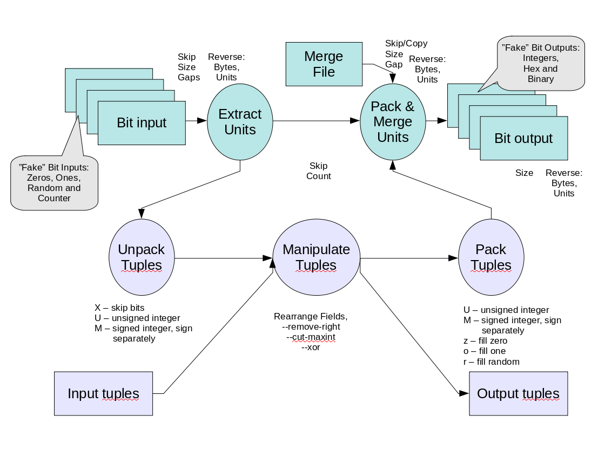

# bdd — Bit Data Dump

High-performance CLI tool and Rust library to interpret, manipulate, stream, merge, and pack arbitrary-width bitstreams.

Originally created by Esa Turtiainen in Python 2 (2010), `bdd` was re-engineered in modern Rust for memory safety, 20-year maintainability, and multi-gigabit throughput with zero external C dependencies.



---

## What is bdd?

Most Unix tools (`dd`, `hexdump`, `od`, standard shell pipes) operate strictly on byte (8-bit) or machine-word (16, 32, 64-bit) boundaries. Real-world binary streams—such as embedded sensor telemetry, cryptographic protocols, SDR/radio frames, network headers, compressed payloads, and legacy archives—frequently pack unaligned fields of arbitrary bit lengths (e.g., 1-bit flags, 3-bit opcodes, 12-bit ADC samples, or 57-bit mantissas).

`bdd` is a **binary-dd for bitstreams**: it allows you to slice, unpack, inspect, transform, interleave, and repack streams of any bit width with single-bit precision.

```
                    [ Input Stream / File / Stdin ]
                                   │
                                   ▼
                       [ Input Bit Accumulator ]
                          (Skip, Unit, Gap)
                                   │
                     (Unpack via --input-pattern)
                                   │
                                   ▼
             Tuple: ( Field 0, Field 1, Field 2, ... )
                                   │
              ┌────────────────────┴────────────────────┐
              ▼                                         ▼
    [ Ordered Pipeline Manipulators ]         [ Secondary Merge ]
    --rearrange, --round, --cut-maxint,       --merge-file
    --xor, --and, --or, --not,
    --shift-left, --shift-right,
    --add, --sub, --mul, --div, --mod,
    --abs, --sign, --filter
              │                                         │
              └────────────────────┬────────────────────┘
                                   │
                                   ▼
         Manipulated Tuple: ( Field 0', Field 1', ... )
                                   │
        ┌──────────────────────────┼──────────────────────────┐
        ▼                          ▼                          ▼
 [ Output Sinks ]          [ Channel Demuxing ]      [ Output Packing ]
 --output-tuples (CSV)     --demux 0:f0.bin          --output-pattern
 --output-json (NDJSON)    --demux-files f0,f1,...            │
 --output-csv                                                 ▼
 --output-visual (ANSI)                          [ Output Bit Accumulator ]
 --output-hex                                                 │
 --output-bits                                                ▼
 --output-integers                               [ Output Stream / Stdout ]
```

---

## 1. Anatomy of a Bit Stream

### The Default Baseline: 8-Bit Streaming

The simplest invocation of `bdd` establishes its fundamental operating principle:

```bash
bdd < a > b
```

This command copies file `a` to file `b` in **default 8-bit units** (1 byte at a time) from standard input to standard output, without any modifications (acting like a byte-exact `cat` or `dd`).

By default:
- **Default Input Unit:** 8 bits (1 byte)
- **Default Output Unit:** 8 bits (1 byte)
- **Default Gaps & Skips:** 0 bits

Every slicing and packing feature in `bdd` builds on top of this baseline. For example, if you change `--input-unit=3` without setting an output unit:

```bash
# Extracts 3-bit values and expands each into an 8-bit byte with 5 leading zero bits:
bdd --input-unit=3 < a > b
```

Because the output unit remains at its default of 8 bits, each 3-bit input unit (`xxx`) is padded on the left with five zero bits (`00000xxx`) to produce an 8-bit byte on standard output.

---

### Units, Skips, and Gaps (The Simple Model)

In `bdd`, all stream dimensions are measured strictly in **bits**, not bytes. In the basic stream model, data is processed as a repeating sequence of **Units**:

```
 Stream Start
      │
      ▼
┌─────────────┬──────────────────┬──────────────┬──────────────────┬──────────────┐
│  Skip Bits  │   Unit (Size)    │     Gap      │   Unit (Size)    │     Gap      │  ...
└─────────────┴──────────────────┴──────────────┴──────────────────┴──────────────┘
```

- **`--input-unit=BITS`** (`-u`): The number of bits in each repeating processing unit (default: `8`).
- **`--input-skip-bits=BITS`**: Initial offset in bits skipped before processing the first unit (default: `0`).
- **`--input-skip-units=UNITS`**: Skip initial N units from stream start.
- **`--input-gap=BITS`**: Number of bits skipped *after* reading each unit (default: `0`).
- **`--input-assert-aligned`**: Aborts with an error if the input stream terminates unaligned to a byte boundary.

#### Basic Slicing Recipes

- **Extract the Most Significant Bit of every byte** (expands 1 bit to an 8-bit byte `0x00` or `0x01`):
  ```bash
  bdd --input-unit=1 --input-gap=7 --output-unit=8 < input.bin
  ```
- **Pack the Least Significant Bit of bytes into a dense bitstream** (e.g. 9 bytes with LSB=1 become two bytes `0xFF` and `0x80`):
  ```bash
  bdd --input-skip-bits=7 --input-unit=1 --input-gap=7 --output-unit=1 < input.bin
  ```

#### Fast $O(1)$ Filesystem Seeking vs. Sequential Streaming

When skipping initial data with `--input-skip-bits` or `--input-skip-units`, or skipping periodic gaps between records (`--input-gap` and raw unit container post-gaps), `bdd` automatically performs an **$O(1)$ filesystem seek** whenever the input is a seekable regular file or file descriptor (including `< file` shell redirection). Instead of reading gigabytes from disk and discarding them byte-by-byte in memory, `bdd` jumps directly across offsets and periodic gaps in microseconds.

If the input is non-seekable (such as a standard pipe `cat file | bdd`, FIFO, or socket), `bdd` seamlessly falls back to streaming sequential reads, discarding skipped bytes without failing or requiring separate flags. To explicitly disable seeking and force sequential stream consumption across all inputs, pass **`--no-seek`** (or `--input-no-seek`, `--merge-no-seek`).


---

### Raw Units & Containers (`--input-raw-unit` and `--input-offset`)

In structured binary files, active fields are rarely isolated in a continuous stream; instead, they reside inside fixed-size physical containers: bytes (8 bits), half-words (16 bits), words (32 bits), audio stereo frames (32 bits), or network headers.

#### How Raw Units Differ from Units

- A **Unit** (`--input-unit`) is the *active payload* you extract and process (e.g. 2 bits).
- A **Raw Unit** (`--input-raw-unit`) is the *outer container, frame, or stride* (e.g. 8 bits or 32 bits) in which the active unit lives.

**The mental arithmetic problem with simple units:** If you want bits 3 and 4 of every byte, simple unit mode requires calculating an initial skip of 2 bits, an active unit of 2 bits, and a trailing gap of 4 bits to reach the next byte. If you subsequently need bit 5, you have to recalculate both the initial skip (4 bits) and the trailing gap (3 bits).

**The solution with raw units:** Declare the container size once with `--input-raw-unit=8`. Then simply state the field's starting position with `--input-offset` and field width with `--input-unit`. `bdd` automatically derives the initial skip and skips the trailing remainder of the container ($R - (O + U)$).

```
               ◄────────────── Raw Unit N (Container / Stride) ──────────────►
Stream: ──────┬──────────────────────┬──────────────────────┬─────────────────┬───────────
...           │        Offset        │     Active Unit      │    Post-Gap     │ Inter-Raw 
              │       (O bits)       │       (U bits)       │(Raw - (O + U))  │ Unit Gap  
──────────────┴──────────────────────┴──────────────────────┴─────────────────┴───────────
```

- **`--input-raw-unit=BITS`**: The repeating container size in bits.
- **`--input-offset=BITS`**: Bit offset of the active unit within each raw unit (default: `0`). Requires `--input-raw-unit`.
- **`--input-unit=BITS`**: Width of the active unit (defaults to `raw-unit - offset`).
- **`--input-gap=BITS`**: When `--input-raw-unit` is set, defines the gap *between* successive raw units (default: `0`).

#### Clean Slicing Recipes with Raw Units

```bash
# Extract bits 3 and 4 of every byte (offset 2, length 2, trailing 4 bits skipped automatically):
bdd --input-raw-unit=8 --input-offset=2 --input-unit=2 --output-integers < input.bin

# Extract bit 5 of every byte (offset 4, length 1, trailing 3 bits skipped automatically):
bdd --input-raw-unit=8 --input-offset=4 --input-unit=1 --output-integers < input.bin

# Extract 16-bit audio channel from interleaved 32-bit stereo (L=0..15, R=16..31):
bdd --input-raw-unit=32 --input-offset=0 --input-unit=16 < audio.raw  # Left channel
bdd --input-raw-unit=32 --input-offset=16 --input-unit=16 < audio.raw # Right channel
```

---

### Large Streams, Gigabyte Skipping & Size Suffixes

Can `bdd` skip over gigabytes of data on the command line? **Yes, without limit:**

- **Full 64-Bit Architecture (`u64`)**: All skips, offsets, gaps, units, and record counts are represented internally as 64-bit unsigned integers. `bdd` can represent bit offsets up to $2^{64}-1 \approx 1.84 \times 10^{19}$ bits, which equals **2.3 Exabytes** ($2,305,843,009$ Gigabytes).
- **Filesystem Seek Limits**: On seekable files, Linux `lseek64` supports offsets up to $2^{63}-1$ bytes = **9.22 Exabytes**, executed in $O(1)$ constant time (microseconds) without memory overhead.
- **Human-Friendly Size Suffixes**: You do not need to calculate zeroes or bit multiplications manually. All numeric arguments accept standard scale suffixes:
  - **Binary multiples (powers of 1024)**: `K`, `M`, `G`, `T`, `P`, `E` (or `Ki`, `Mi`, `Gi`, `Ti`, `Pi`, `Ei`).
  - **Decimal multiples (powers of 1000)**: `KB`, `MB`, `GB`, `TB`, `PB`, `EB`.
  - **Byte-scaled bit skips**: On bit options (`--input-skip-bits`, `--merge-skip-bits`), specifying `B` (e.g. `10GiB`, `4GB`, `100B`) automatically multiplies bytes by 8 bits.
- **Multiplication Expressions**: Numbers on the command line never run out or require manual mental calculations. All size and count options support multiplication expressions using `*` or `x`:
  - **Unit-stride skipping**: Skip 1,000,000 24-bit units directly: `--input-skip-bits=1000000*24` (or `--input-skip-bits=1000*1000*24` or `--input-skip-bits=1M*24`).
  - **2D/3D dimensions and frame strides**: Easily express multi-dimensional buffers: `--input-skip-bits=1920x1080*24` or `--input-skip-bits="1920 * 1080 * 3B"`.
  - **Sizing units and offsets**: Express byte multiples: `--input-unit=3*8` (24-bit unit) or `--input-offset=2*8` (16-bit offset).
  - **Scaled counts and repeats**: `--count=1000*10`, `--input-repeat=10*5`.

```bash
# Skip 1,000,000 24-bit units directly in bits:
bdd --input-file=samples.bin --input-skip-bits=1000000*24 --output-hex

# Skip a 1080p 24-bit uncompressed RGB frame buffer:
bdd --input-file=video.raw --input-skip-bits=1920x1080*24 --count=100 --output-hex

# Instantly seek 10 GiB into a file and extract 4 bytes in hex:
bdd --input-file=large_disk.img --input-skip-bits=10GiB --count=4 --output-hex

# Skip 10 million 8-bit units:
bdd --input-file=stream.bin --input-unit=8 --input-skip-units=10M < stream.bin

# Process at most 500k records:
bdd --input-tuples --count=500k < records.csv
```

### Unit Sizing and Alignment Rules

- **Default Unit Size**: As established above, both input unit size and output unit size default to 8 bits (`bdd < a > b` copies bytes unchanged).
- **Expansion (Output > Input)**: If the output unit is larger than the input unit, the value is treated as an integer and the left (most significant) bits are padded with zeros.
- **Truncation (Output < Input)**: If the output unit is smaller than the input unit, the left (most significant) bits are truncated.
- **Stream Termination**: If the total bits written to an output byte stream are not a multiple of 8, the missing least-significant bits of the final byte are padded with zeros.

---

## 2. The Tuple Concept & Pattern Grammar

Rather than treating a bit unit as an opaque integer, `bdd` allows dividing a unit into named fields called a **Tuple** (analogous to a structured row in a relational database):

```
 Raw Unit: 0 0 1 1 1 0 1 1 1  (9 bits)
 Pattern:  3U 1x 2u 3M
           │   │  │  │
           │   │  │  └─► 3-bit Signed with Sign-Split  ──► Yields TWO fields: [1 (sign), 1 (abs)]
           │   │  └────► 2-bit Unsigned (Bit-Reversed) ──► Field value: 1
           │   └───────► 1-bit Skip                    ──► Discarded (not in tuple)
           └───────────► 3-bit Unsigned Integer        ──► Field value: 1

 Unpacked Tuple: (1, 1, 1, 1)
```

### Pattern Specifiers Reference

Every field in an `--input-pattern` or `--output-pattern` is specified as `[<bits>]<type>` (with optional repetition multipliers like `4*8B`, `4*B`, or `2*(4U4u)`).

When `<bits>` is omitted, natural bit width defaults are automatically assigned:
- `B` $\to$ 8 bits (byte; identical to `8U` or `8B` in standard big-endian bit order. Conversely, `8u` reverses bit order within the byte, matching `8b`).
- `F` / `f` $\to$ 32 bits (IEEE 754 single)
- `D` / `d` $\to$ 64 bits (IEEE 754 double)
- `H` / `h` / `Y` / `y` $\to$ 16 bits (FP16 / BF16)
- `E` / `e` / `Q` / `q` / `C` / `c` / `K` / `k` $\to$ 8 bits (FP8 / Char / Counter)
- `m` $\to$ 4 bits (NVFP4)
- `U` / `u` / `S` / `s` / `x` / `X` / `z` / `o` / `r` $\to$ 1 bit

| Code | Name | Description | Allowed Bit Widths | Valid Context |
|---|---|---|---|---|
| `nU` / `nB` | Unsigned Integer / Byte | Standard big-endian unsigned integer (default 1 / 8 bits) | Any positive integer | Input / Output |
| `nu` / `nb` | Unsigned (Reversed) | Unsigned integer with reversed bit order (default 1 / 8 bits) | Any positive integer | Input / Output |
| `nS` | Signed Integer | Two's complement signed integer (returns negative values; default 1 bit) | Any positive integer | Input / Output |
| `ns` | Signed (Reversed) | Two's complement with reversed bit order (default 1 bit) | Any positive integer | Input / Output |
| `nM` | Sign-Split Integer | Two's complement integer split into two fields: `[sign, abs(val)]` (default 1 bit) | Any positive integer | Input / Output |
| `nm` | Sign-Split (Reversed)| Sign-split integer with reversed bit order (default 1 bit) | Any positive integer | Input / Output |
| `32F` / `32f` | 32-bit Float | IEEE 754 single-precision float (`f` reverses bits; default 32 bits) | Exactly 32 bits | Input / Output |
| `64D` / `64d` | 64-bit Double | IEEE 754 double-precision float (`d` reverses bits; default 64 bits) | Exactly 64 bits | Input / Output |
| `16H` / `16h` | Half-Precision Float | IEEE 754 half-precision float (FP16; default 16 bits) | Exactly 16 bits | Input / Output |
| `16Y` / `16y` | Bfloat16 | Google Brain Bfloat16 float (BF16; default 16 bits) | Exactly 16 bits | Input / Output |
| `8E` / `8e` | OCP FP8 (E4M3) | Open Compute / NVIDIA Hopper FP8 E4M3FN (default 8 bits) | Exactly 8 bits | Input / Output |
| `8Q` / `8q` | OCP FP8 (E5M2) | Open Compute / NVIDIA Ada FP8 E5M2 (default 8 bits) | Exactly 8 bits | Input / Output |
| `6E` / `6e` | OCP FP6 (E3M2) | Open Compute Microscaling FP6 E3M2 | Exactly 6 bits | Input / Output |
| `4E` / `4e` | OCP / NVFP4 (E2M1) | NVIDIA Blackwell / OCP Microscaling FP4 E2M1 (default 4 bits) | Exactly 4 bits | Input / Output |
| `nC` / `nc` | Characters / Bytes | Raw byte/character sequence (retains byte fidelity; default 8 bits) | Multiples of 8 bits | Input / Output |
| `nK` / `nk` | Sequence Counter | Auto-incrementing unit counter. In output patterns, emits counter without consuming tuple fields. In input patterns, reads unsigned integer. (Default 8 bits) | Any positive integer | Input / Output |
| `nx` / `nX` | Skip / Discard | Input: skips $n$ bits. Output: consumes and discards 1 tuple field without emitting bits. (Default 1 bit) | Any positive integer | Input / Output |
| `nz` | Fill Zeros | Inserts $n$ constant zero bits (default 1 bit) | Any positive integer | Output only |
| `no` | Fill Ones | Inserts $n$ constant one bits (default 1 bit) | Any positive integer | Output only |
| `nr` | Fill Random | Inserts $n$ pseudo-random bits (default 1 bit) | Any positive integer | Output only |

### Pattern Repetition Multipliers

Patterns support multiplier syntax for repetitive fields, arrays, and tensor weights:
`COUNT*SPEC` or `COUNT*(SPEC1 SPEC2 ...)`

> [!IMPORTANT]
> A multiplier creates **$N$ separate fields** in the tuple, **not** a single combined integer.
> - `8*3U` expands to eight separate 3-bit fields: `3U3U3U3U3U3U3U3U` (producing an 8-field tuple `(f0, f1, f2, f3, f4, f5, f6, f7)`, total width 24 bits). To extract a single 24-bit integer, use `24U` instead.
> - `4*8B` (or `4*B`) expands to four 8-bit byte fields: `8B8B8B8B`.
> - `10*16H` expands to ten 16-bit half-precision float fields.
> - `2*(4U4u)` expands to four alternating fields: `4U4u4U4u`.
> - Named repetition `w:8*3U` expands to eight indexed fields: `w_0:3U, w_1:3U, ..., w_7:3U`.

### Distinction Between `S` and `M`

- **`S` (Signed Integer)**: Directly represents negative values (e.g., `-5`). When printed via `--output-tuples`, it outputs `-5`.
- **`M` (Magnitude & Sign Split)**: Decodes a signed two's complement number into **two separate unsigned fields**:
  1. `sign`: `0` for positive, `1` for negative.
  2. `magnitude`: `abs(value)`.
  This allows arithmetic, filtering, or routing based on sign and absolute value independently.

### Floating-Point Format Transcoding & The Universal `f64` Currency

`bdd` provides native bitstream transcoding between all IEEE 754 and modern AI/GPU floating-point formats:
- **64-bit Double (`64D` / `64d`)**: IEEE 754 binary64
- **32-bit Float (`32F` / `32f`)**: IEEE 754 binary32
- **16-bit Half (`16H` / `16h`)**: IEEE 754 binary16 (FP16)
- **16-bit Bfloat16 (`16Y` / `16y`)**: Google Brain Bfloat16 (BF16)
- **8-bit FP8 E4M3 (`8E` / `8e`)**: OCP / NVIDIA Hopper FP8 E4M3FN (1-4-3, bias 7)
- **8-bit FP8 E5M2 (`8Q` / `8q`)**: OCP / NVIDIA Ada FP8 E5M2 (1-5-2, bias 15)
- **6-bit FP6 E3M2 (`6E` / `6e`)**: OCP Microscaling FP6 E3M2 (1-3-2, bias 3)
- **4-bit FP4 E2M1 (`4E` / `4e`)**: NVIDIA Blackwell / OCP Microscaling NVFP4 (1-2-1, bias 1)

#### The `f64` Pipeline Architecture
1. **Universal Decoding to `f64`**: When reading bitstreams through `--input-pattern`, any floating-point token (`32F`, `64D`, `16H`, `16Y`, `8E`, `8Q`, `6E`, `4E`) is decoded into an IEEE 754 64-bit double (`f64`) in the internal tuple representation (`Field::Float(f64)`). Subnormal numbers (gradual underflow), infinities, and NaNs are decoded according to IEEE 754 and OCP specifications.
2. **Intermediate Manipulation & Rounding**: Inside the tuple pipeline, floating-point values can be rearranged, filtered, or rounded using `--round` (e.g. `--round 0,round_ties_even`, `--round 0,floor`, `--round 0,ceil`, `--round 0,trunc`).
3. **Universal Encoding / Downcasting from `f64`**: When packing tuples into an output bitstream through `--output-pattern`, each target float token encodes the internal `f64` into its target bit layout using round-to-nearest-even (or round-to-nearest).

#### Zero-Dependency Pure-Rust AI Codecs
Standard Rust (`std`) only supports `f32` and `f64` natively. Experimental features (`f16`/`f128`) are unstable, and standard Rust provides no primitives for OCP FP8, FP6, or Blackwell FP4. `bdd` avoids heavy or unstable external dependencies by implementing custom, bit-exact codecs directly in `src/float_types.rs`, ensuring maximum performance and portability.

#### Transcoding Examples
Convert between arbitrary float representations simply by combining `--input-pattern` and `--output-pattern`:

```bash
# Transcode 32-bit float to 16-bit IEEE half-precision (FP32 -> FP16):
bdd --input-pattern=32F --output-pattern=16H < weights_fp32.bin > weights_fp16.bin

# Quantize FP16 weights directly to NVIDIA Hopper OCP FP8 (E4M3):
bdd --input-pattern=16H --output-pattern=8E < model_fp16.bin > model_fp8.bin

# Quantize FP16 to NVIDIA Blackwell 4-bit float (NVFP4 E2M1):
bdd --input-pattern=16H --output-pattern=4E < model_fp16.bin > model_fp4.bin

# Upcast Blackwell 4-bit floats back to FP32 single precision:
bdd --input-pattern=4E --output-pattern=32F < model_fp4.bin > unpacked_fp32.bin

# Quantize with explicit downward truncation before packing:
bdd --input-pattern=32F --round=0,floor --output-pattern=8E < in.bin > out.bin
```

---

## 3. Flexible Pipeline & Tuple Manipulation

Once unpacked into a tuple, fields can be transformed using pipeline manipulators executed in the exact order specified on the command line. Fields are referenced by index starting from `0` (or negative index from end):

### Pipeline Manipulators

- **`--rearrange=F0,F1,...`**: Reorders, duplicates, or drops fields (e.g., `--rearrange=1,0`).
- **`--round=FIELD,LIMIT[,MODE]`** or **`--round=FIELD,MODE`** *(alias: `--cut-maxint`)*: Rounds floating-point fields or clamps/bounds integer fields within `[-LIMIT, LIMIT]` (or `[0, LIMIT]` if unsigned). `MODE` can be specified using comma or colon (e.g. `--round 0,floor` or `--round 0,127,wrap`). When `LIMIT` is omitted, the rounding mode is applied without magnitude clamping. Supported modes:
  - `saturate` / `clamp` (default when limit is specified): Clamps out-of-bounds values to `LIMIT` or `-LIMIT`.
  - `wrap` / `wrapping`: Wraps values around using modular arithmetic (`[0, LIMIT]` for unsigned, `[-LIMIT, LIMIT]` for signed).
  - `zero` / `reset`: Sets out-of-bounds values to 0.
  - `drop` / `filter` / `checked`: Discards the tuple entirely if the value exceeds bounds.
  - `trunc` / `truncate`: Truncates magnitude toward zero.
  - `floor`: Rounds toward negative infinity.
  - `ceil`: Rounds toward positive infinity.
  - `round`: Rounds to nearest neighbor, ties away from zero.
  - `round_ties_even` / `even` / `bankers`: Rounds to nearest neighbor, ties to nearest even digit (Rust `f64::round_ties_even` / IEEE 754 default).

- **`--shift-left=FIELD,BITS`**: Bitwise left-shifts field by `BITS`.
- **`--xor=FIELD,PARAM`**: Bitwise XOR with parameter (supports hex `0x...`, bin `0b...`, or bit-count mask).
- **`--and=FIELD,PARAM`**: Bitwise AND with parameter.
- **`--or=FIELD,PARAM`**: Bitwise OR with parameter.
- **`--not=FIELD`**: Bitwise NOT (inverts field bits).
- **`--add=FIELD,PARAM`**: Adds integer parameter to field.
- **`--sub=FIELD,PARAM`**: Subtracts integer parameter from field.
- **`--mul=FIELD,PARAM`**: Multiplies field by parameter.
- **`--div=FIELD,PARAM`**: Integer division of field by parameter.
- **`--mod=FIELD,PARAM`**: Modulo of field by parameter.
- **`--abs=FIELD`**: Converts a signed field to its absolute value (syntax: `--abs 0` or legacy `--abs 0,0`).
- **`--sign=FIELD`**: Isolates sign bit (`0` = positive, `1` = negative).
- **`--filter=FIELD,OP,VALUE`**: Drops tuples where predicate is false (`==`, `!=`, `<`, `<=`, `>`, `>=`).

### Ordered Pipeline Example

Chain multiple transformations in arbitrary sequence:
```bash
# Add 10, multiply by 2, and filter values greater than 25:
bdd --input-counter --count 10 --input-pattern 8U \
    --add 0,10 --mul 0,2 --filter "0,>,25" --output-json
```

### Advanced Bit-Slicing Recipe

*Problem from presentation:* Input is a stream of signed bytes (`8M`). We want to clamp the value so $-128$ becomes $-127$, isolate the magnitude, and extract only the most significant bit of the magnitude:

```bash
bdd --input-pattern=8M --rearrange=-1 --cut-maxint=0,127 --remove-right=0,6 --output-unit=1 < input.bin
```

Explanation:
1. `8M` produces `[sign, magnitude]`.
2. `--rearrange=-1` selects only the last field (magnitude).
3. `--cut-maxint=0,127` clamps the magnitude to 127.
4. `--remove-right=0,6` shifts right by 6 bits, leaving the 7th bit (MSB of magnitude).
5. `--output-unit=1` outputs the single bit.

---

## 4. Synthetic ("Fake") Streams & Text Formats

`bdd` can synthesize bitstreams without requiring input files, and output in human-readable or script-friendly formats:

### Synthetic Stream Sources

- **`--input-zeros` (`-0`)**: Endless stream of zero bits.
- **`--input-ones` (`-1`)**: Endless stream of one bits.
- **`--input-random` (`-r`)**: Pseudo-random bits (PRNG).
- **`--input-counter` (`-c`)**: Sequential integer counter starting at 0, incrementing by 1 per unit.
- **`--count=N`**: Limit processing to $N$ units (0 = infinite).
- **`--skip=N`**: Skip $N$ initial units before processing.

### Human-Readable & Script Sinks

- **`--output-hex` (`-x`)**: Formatted hexadecimal representation per unit, grouped neatly into power-of-two line widths.
- **`--output-bits` (`-b` / `--output-bit`)**: ASCII bit strings (`'0'` and `'1'`) per unit.
- **`--output-integers` (`-i` / `--output-integer`)**: One unsigned decimal integer per line (ideal for Unix pipelines: `awk`, `sort`, `uniq`).
- **`--output-tuples` (`-T` / `--output-tuple`)**: Comma-separated values per unit.
- **`--output-json`**: Newline-delimited JSON (NDJSON) record per tuple (ideal for `jq`, Python, databases).
- **`--output-csv`**: Comma-separated values (with optional `--csv-header="col1,col2"`).
- **`--output-visual`**: Interactive colorized terminal dump rendering unaligned field slices in alternating ANSI colors.
- **`--input-tuples` (`-t`)**: Ingest comma-separated values directly from stdin/file into tuples. Quoted values (e.g. `"hello"`, `'123'`) are preserved as byte strings (`Field::Bytes`) instead of numbers, preserving exact text for character/byte patterns (`c` / `C`).

### Packing from Text & Tuples

```bash
# Pack octal numbers from text tuples into binary:
printf "1,2,3\n3,7,7\n" | bdd --input-tuples --output-pattern='2U3U3U' | od -t o1
# Outputs: 123 377

# Pack two 4-bit numbers into hex bytes:
echo -en "1,2\n3,4" | bdd --input-tuples --output-pattern=4U4U | od -t x1
# Outputs: 12 34

# Discard tuple fields on output using 'x' (drops the second field):
echo -en "10,99,20\n" | bdd --input-tuples --output-pattern='8U,x,8U' --output-hex
# Outputs: 0a14

# Inject an embedded auto-incrementing sequence counter using 'k' / 'K':
echo -en "10,20\n30,40\n" | bdd --input-tuples --output-pattern='8U,8U,8K' --output-hex
# Outputs: 0a1400 1e2801

# Pack bare pattern types with natural default widths:
printf "1,2\n" | bdd --input-tuples --output-pattern='BB' --output-hex
# Outputs: 0102

# Pack text numbers into 64-bit IEEE double-precision floats:
printf "1.0\n2.0\n" | bdd --input-tuples --output-pattern=64D > doubles.bin
```

---

## 5. De-mystifying Bit Reversals

Reversing bits in binary processing can easily become confusing. `bdd` cleanly isolates bit reversals into four distinct operational layers:

```
[ Input Byte Stream ]
        │
  (1)   ├─► --reverse-input-bytes   (Reverses bits within each 8-bit byte read)
        ▼
[ Input Units ]
        │
  (2)   ├─► --reverse-input-units   (Reverses all bits across the entire unit)
        ▼
[ Tuple Fields ]
        │
  (3)   ├─► Lowercase Pattern Codes (u, s, m, c - reverses bits within specific field)
        ▼
[ Output Units ]
        │
  (4)   ├─► --reverse-output-units  (Reverses all bits across the entire output unit)
        ▼
[ Output Byte Stream ]
        │
  (5)   └─► --reverse-output-bytes  (Reverses bits within each 8-bit byte written)
```

- **`--input-little-endian`**: Shorthand combining `--reverse-input-bytes` and `--reverse-input-units`.
- **`--output-little-endian`**: Shorthand combining `--reverse-output-bytes` and `--reverse-output-units`.

---

## 6. Stream Merging & Interleaving

The merge stream reads a secondary file and interleaves its data into the primary stream:

```text
 Primary Stream Units:  [ Unit 0 ]                            [ Unit 1 ]
                             │                                    │
 Merge 1 Stream Units:       │       [ M1_0 ]                     │       [ M1_1 ]
                             │          │                         │          │
 Merge 2 Stream Units:       │          │       [ M2_0 ]          │          │       [ M2_1 ]
                             ▼          ▼          ▼              ▼          ▼          ▼
 Interleaved Output:    [ Unit 0 ]  [ M1_0 ]   [ M2_0 ]      [ Unit 1 ]  [ M1_1 ]   [ M2_1 ]
```

- **`--merge-file=PATH`**: Interleave data from secondary files (can be specified multiple times for N-way round-robin merge, `"-"` for stdin).
- **`--merge-files=PATHS`**: Comma- or space-separated list of merge files to interleave round-robin.
- **`--merge-unit=BITS`**: Size of merge units in bits (default: 8).
- **`--merge-copy-first=BITS`**: Copies an initial bit header/preamble from the merge file *before* starting the interleaved loop.
- **`--drop-partial-eof`** (aliases: `--drop-trailing-bits`, `--no-pad-eof`): Discards incomplete trailing bits at EOF instead of zero-padding them into a synthetic extra unit.
- **`--merge-drop-partial-eof`**: Discards incomplete trailing bits at EOF in the merge stream.

### Example: Hex Dump with Interleaved Memory Addresses

Interleave a 12-bit linear address counter with actual data bytes from `/etc/passwd`:

```bash
bdd --input-counter --count=16 --input-unit=12 --output-unit=12 --merge-file=/etc/passwd --output-hex
```

Output:
```
000 72 001 6f 002 6f 003 74 004 3a 005 78 006 3a 007 30
008 3a 009 30 00a 3a 00b 72 00c 6f 00d 6f 00e 74 00f 3a
```

### Example: Multi-File Round-Robin Interleaving

Interleave primary stream units with units from two independent secondary streams:

```bash
bdd --input-counter --count=2 --input-unit=8 --output-unit=8 \
    --merge-file=ch1.bin --merge-file=ch2.bin --output-hex
# or equivalently:
bdd --input-counter --count=2 --input-unit=8 --output-unit=8 \
    --merge-files=ch1.bin,ch2.bin --output-hex
```

---

## 7. Command Line Options Reference

```
Usage: bdd [OPTIONS] [FILE]

Arguments:
  [FILE]  Input file (defaults to standard input '-')

Input Unit & Raw Unit Options:
  -p, --input-pattern <PATTERN>    Bit pattern to unpack input (e.g. "3U1x2u3M")
  -u, --input-unit <BITS>          Input unit size in bits (shorthand for <BITS>U)
      --preset <NAME>              Use built-in protocol or float preset (e.g. mp3-header, mpeg-ts, nvfp4)
      --list-presets               List all built-in format presets and exit
      --input-skip-bits <BITS>     Initial bit offset before first unit [default: 0]
      --input-skip-units <UNITS>   Skip initial N units from input stream [default: 0]
      --input-gap <BITS>           Bit gap skipped after each unit (or between raw units) [default: 0]
      --input-raw-unit <BITS>      Size of repeating raw container/frame in bits
      --input-offset <BITS>        Bit offset of unit inside raw unit [default: 0]
      --input-assert-aligned       Error if EOF is not byte-aligned
      --drop-partial-eof           Discard incomplete trailing bits at EOF instead of zero-padding
      --no-seek, --do-not-seek     Globally disable seeking on all inputs (force streaming read)
      --input-no-seek              Disable seeking specifically on primary input
      --input-use-seek             Explicitly enable seeking on input (default: true)

Synthetic Stream Sources:
  -c, --input-counter              Generate sequential counter numbers (0, 1, 2...)
  -0, --input-zeros                Generate endless stream of zero bits
  -1, --input-ones                 Generate endless stream of one bits
  -r, --input-random               Generate pseudo-random bits
  -t, --input-tuples               Read comma-separated tuple lines from text input
      --skip <UNITS>               Skip initial N units [default: 0]
      --count <COUNT>              Process at most N units (0 or omitted = infinite) [default: 0]

Bit Reversal Options:
      --reverse-input-bytes        Reverse bit order within each input byte
      --reverse-input-units        Reverse bit order across entire input unit
      --input-little-endian        Combined byte and unit reversal for input
      --reverse-output-bytes       Reverse bit order within each output byte
      --reverse-output-units       Reverse bit order across entire output unit
      --output-little-endian       Combined byte and unit reversal for output

Tuple Manipulators:
      --rearrange <FIELDS>         Reorder output fields (e.g. "1,0" or "-1,0")
      --round <F,LIMIT[,MODE]>     Round or clamp field F (alias: --cut-maxint; modes: saturate, wrap, zero, drop, trunc, floor, ceil, round, round_ties_even)
      --remove-right <F,BITS>      Right-shift field F by BITS
      --shift-right <F,BITS>       Right-shift field F by BITS (synonym)
      --shift-left <F,BITS>        Left-shift field F by BITS
      --xor <F,PARAM>              Bitwise XOR field F with PARAM (or mask of N ones)
      --and <F,PARAM>              Bitwise AND field F with PARAM
      --or <F,PARAM>               Bitwise OR field F with PARAM
      --not <FIELD>                Bitwise NOT (inverts bits of field F)
      --add <F,PARAM>              Add PARAM to field F
      --sub <F,PARAM>              Subtract PARAM from field F
      --mul <F,PARAM>              Multiply field F by PARAM
      --div <F,PARAM>              Integer division of field F by PARAM
      --mod <F,PARAM>              Modulo of field F by PARAM
      --abs <FIELD>                Replace signed field F with abs(F)
      --sign <FIELD>               Replace signed field F with sign bit (0/1)
      --filter <F,OP,VAL>          Filter tuples where predicate is false (==, !=, <, <=, >, >=)

Output Unit & Pattern Options:
      --output-pattern <PATTERN>   Bit pattern to pack output (supports AI floats, multipliers & counter)
      --output-unit <BITS>         Output unit size in bits (defaults to input unit size or pattern width)
  -x, --output-hex                 Output units as formatted hexadecimal strings
  -b, --output-bits                Output units as ASCII bit strings ('0' and '1')
  -i, --output-integers            Output unsigned integer per unit (one per line)
  -T, --output-tuples              Output fields as comma-separated tuples
      --output-json                Output tuples as newline-delimited JSON (NDJSON)
      --json-object                Emit JSON as keyed objects instead of positional arrays
      --json-fields <FIELDS>       Explicit comma-separated field names for JSON/CSV
      --output-csv                 Output tuples as CSV
      --csv-header <HEADER>        Optional CSV column header row
      --output-visual              Colorized ANSI terminal dump of unaligned fields

Inspection, Web UI & Model Context Protocol (MCP):
      --explain-pattern [PATTERN]  Analyze bit layout, byte alignment, and field breakdown
      --probe [FILE]               Inspect binary entropy, byte classes, periodic strides, and strings
      --mcp                        Launch native JSON-RPC 2.0 Model Context Protocol (MCP) server
      --serve [PORT]               Launch interactive Web UI browser app (aliases: --web, --gui) [default: 7788]

Demuxing & Channel Splitting:
      --demux <FIELD:PATH>         Route individual tuple field to a dedicated output file
      --demux-files <PATHS>        Comma-separated list of output files for fields 0, 1, 2...
      --input-repeat <COUNT>       Repeat input stream N times (0 = infinite)

Merge Options:
      --merge-file <PATH>          Interleave stream from secondary file (repeatable for N-way merge)
      --merge-files <PATHS>        Comma- or space-separated list of merge files
      --merge-unit <BITS>          Bit width of each merge unit [default: 8]
      --merge-skip-bits <BITS>     Initial bit offset in merge file [default: 0]
      --merge-skip-units <UNITS>   Skip initial N units in merge file [default: 0]
      --merge-gap <BITS>           Bit gap skipped after each merge unit (or between raw units) [default: 0]
      --merge-copy-first <BITS>    Copy initial header bits from merge file first
      --merge-raw-unit <BITS>      Size of repeating merge container in bits
      --merge-offset <BITS>        Bit offset of unit inside merge raw unit [default: 0]
      --merge-drop-partial-eof     Discard incomplete trailing bits at EOF in merge stream
      --merge-no-seek              Disable seeking specifically on merge file
      --merge-use-seek             Explicitly enable seeking on merge file (default: true)

General:
  -h, --help                       Print help
  -V, --version                    Print version
```

---

## 8. AI Ergonomics, Binary Inspection & Model Context Protocol (MCP)

`bdd` provides native primitives for autonomous AI coding agents, reverse engineers, and pipeline automation:

### Built-in Format Presets (`--preset`, `--list-presets`)
Instead of manually calculating complex bit offsets, standard protocol and AI weight presets configure input patterns, unit widths, and field names in one step:
```bash
# List all 13 standard presets:
bdd --list-presets
```
Standard presets include:
- `mp3-header` (MPEG Audio Frame Header, 32 bits)
- `mpeg-ts` (MPEG Transport Stream Header, 32 bits from 188B packet)
- `wav-header` (RIFF WAV Header Identifier, 96 bits)
- `jpeg-sof0` (JPEG Start of Frame 0, 80 bits)
- `h264-nal` (H.264 / AVC NAL Unit Header, 8 bits)
- `nvfp4` (Dual packed NVIDIA NVFP4 E2M1 weights, 8 bits)
- `fp6-e3m2` (Quad packed FP6 E3M2 AI weights, 24 bits)
- `fp8-e4m3` (OCP FP8 E4M3 AI weight, 8 bits)
- `fp8-e5m2` (OCP FP8 E5M2 AI weight, 8 bits)
- `bf16` (Bfloat16 Brain Floating Point, 16 bits)
- `fp16` (IEEE 754 Half-Precision Float, 16 bits)
- `ipv4-header` (IPv4 Packet Header, 160 bits / 20 bytes)
- `udp-header` (UDP Datagram Header, 64 bits / 8 bytes)
- `tcp-header` (TCP Segment Header with discrete sub-byte flags, 160 bits / 20 bytes)
- `riscv-r-type` (RISC-V 32-bit R-type Instruction, 32 bits)

### Keyed JSON Objects (`--json-object`, `--json-fields`)
Pair named patterns or presets with `--json-object` to emit newline-delimited JSON dictionaries where keys match field names:
```bash
bdd --input-file stream.ts --input-raw-unit 188B --preset mpeg-ts --json-object --count 3
```
Output:
```json
{"afc":1,"cc":0,"pid":0,"priority":0,"pusi":0,"scrambling":0,"sync":71,"tei":0}
{"afc":1,"cc":1,"pid":17,"priority":0,"pusi":1,"scrambling":0,"sync":71,"tei":0}
{"afc":1,"cc":2,"pid":256,"priority":0,"pusi":1,"scrambling":0,"sync":71,"tei":0}
```

### Pattern Explainer (`--explain-pattern`)
Examine bit ranges, byte alignments, offsets, and field types without running a processing job:
```bash
bdd --explain-pattern "sync:11u,version:2u,layer:2u,protect:1b,bitrate:4u"
# Machine-readable JSON output for AI toolchains:
bdd --explain-pattern "sync:11u,version:2u" --output-json
```

### Binary Prober (`--probe`)
Inspect unknown binary blobs without prior schema knowledge. Computes Shannon entropy ($H = -\sum p_i \log_2 p_i$), byte class distributions, periodic stride autocorrelation across offsets 1..512 bytes (detecting MPEG-TS, 24-bit audio, or fixed-stride telemetry), and extracts printable ASCII strings:
```bash
bdd --probe payload.bin
# Full JSON metrics:
bdd --probe payload.bin --output-json
```

### Model Context Protocol (MCP) Server (`--mcp`)
`bdd` includes a native JSON-RPC 2.0 stdio MCP server for agent integration:
```bash
bdd --mcp
```
Registered MCP tools:
- `bdd_slice`: Slices a file or hex string by pattern/preset and outputs text or JSON.
- `bdd_probe`: Analyzes entropy, periodic strides, and format heuristics.
- `bdd_explain_pattern`: Explains schema bit offsets and field types.
- `bdd_list_presets`: Returns available protocol presets.

### Interactive Web Application (`--serve`)
`bdd` embeds a complete, zero-dependency browser application directly into the binary:
```bash
bdd --serve            # Launches web UI at http://localhost:7788
bdd --serve 8080       # Custom port (aliases: --web, --gui)
# Or via make targets:
make web               # Compiles and runs ./bdd --serve
make web-py            # Standalone Python backend (python3 web/server.py)
```

**Key Features:**
- **File Upload & Drag-and-Drop**: Upload binary blobs, capture files, or sample datasets.
- **Protocol Presets**: 1-click loading for MPEG-TS, MP3 Header, NVFP4, FP8, WAV, RGB565, and more.
- **Live Visual Bit Breakdown**: Color-coded field layout (uint, int, float, char, discard, counter) with exact bit offsets and byte boundaries.
- **Real-Time Command Generator**: Generates equivalent copy-pasteable `bdd` CLI commands as you tune options.
- **Multi-Sink Results Inspector**: Switch seamlessly between Formatted JSON, Hex Dump, Color Matrix, CSV, Raw Bits, and Binary Download.
- **Binary Prober in Browser**: Run entropy, byte class, and periodic stride autocorrelation with one click.

### Agent Documentation (`llms.txt` & Agent Skill)
- **[`llms.txt`](llms.txt)**: High-density reference tailored for LLM context windows.
- **Agent Skill**: Available at `~/.agents/skills/bdd/SKILL.md`.

---

## 9. Channel Demuxing & Splitting

When processing multiplexed packet formats or interleaved bitstreams (e.g. audio + video, header + payload), `bdd` can demux fields into independent files or pipes:

```bash
# Split interleaved 16-bit audio and 32-bit video into separate streams:
bdd --input-pattern=16B32B \
    --demux 0:audio.raw \
    --demux 1:video.raw < input.bin

# Alternatively, using --demux-files shorthand:
bdd --input-pattern=16B32B --demux-files=audio.raw,video.raw < input.bin
```

---

## 10. Programmatic Interfaces (C Header & Python)

`bdd` exports clean C-ABI symbols in `libbdd.so` and includes an official C header ([`include/bdd.h`](include/bdd.h)) and a zero-dependency Python wrapper ([`python/bdd.py`](python/bdd.py)):

### Python (`ctypes` & `pyproject.toml`)

```python
from bdd import Bdd

b = Bdd()

# Fast hardware bit-reversal:
assert b.reverse_bits(0x0F, 8) == 0xF0

# Unpack bitfields into Python tuple:
fields = b.unpack("4U4U", 0xA5)   # -> (10, 5)

# Pack Python tuple into raw integer:
unit = b.pack("4U4U", (10, 5))    # -> 0xA5

# Native AI float conversion (FP16, BF16, FP8, FP4):
val = b.decode_f16(0x3C00)        # -> 1.0
bits = b.encode_f16(1.0)          # -> 0x3C00
```

### C / C++ API

```c
#include "bdd.h"
#include <stdio.h>

int main() {
    uint64_t fields[2];
    bdd_unpack_u64("4U4U", 0xA5, fields, 2);
    printf("Field 0: %lu, Field 1: %lu\n", fields[0], fields[1]); // 10, 5
    return 0;
}
```

---

## 11. UTF-8 Stream Processing & Architectural Study

For an in-depth analysis of UTF-8 bitstream hazards, byte-alignment constraints, continuation header preservation, and Unicode scalar value processing in `bdd`, consult the technical report:
* [`docs/utf8_study.md`](docs/utf8_study.md)

---

## 12. Performance & Throughput Benchmarks

`bdd` achieves high throughput across arbitrary bit boundaries, balancing hardware register acceleration for sub-64-bit units with arbitrary-precision arithmetic for large bignum fields.

Measured via `make bench` (`benches/throughput.rs`) on Linux x86_64:

| Operation | Total Volume | Throughput (bits/s) | Throughput (Bytes/s) | Notes |
|---|---|---|---|---|
| **Hardware 64-bit Bit Reversal** | 128 Mbits | **16.00 Gbps** | 2,000 MB/s | Direct CPU `u64::reverse_bits()` |
| **Bignum 1024-bit Packing/Unpacking** | 10.2 Mbits | **5.27 Gbps** | 658.6 MB/s | Large-block bignum bitfield packing |
| **Bignum 256-bit Packing/Unpacking** | 12.8 Mbits | **1.90 Gbps** | 237.2 MB/s | SHA-256 size field packing/unpacking |
| **Synthetic 8-bit Linear Stream** | 16.0 Mbits | **234.5 Mbps** | 29.3 MB/s | Continuous bit generation & sink flush |
| **1-bit Single-Bit Resolution Stream** | 0.5 Mbits | **43.3 Mbps** | 5.4 MB/s | Single-bit slice accumulation & packing |
| **Bignum 1024-bit Bit Reversal** | 5.1 Mbits | **39.4 Mbps** | 4.9 MB/s | Full arbitrary-precision bit reversal |
| **Unaligned 3-bit to 8-bit Extraction** | 3.0 Mbits | **39.0 Mbps** | 4.9 MB/s | Cross-byte boundary accumulation |
| **Tuple Pipeline (`2U3U3U` -> Rearrange)** | 2.0 Mbits | **29.7 Mbps** | 3.7 MB/s | Multi-field unpack, reorder & repack |

---

## 13. Architecture & Codebase Design

The Rust implementation is organized cleanly into modular crates:

```
src/
├── lib.rs          # Public library crate interface
├── main.rs         # Thin CLI wrapper & early dispatcher
├── error.rs        # Strongly-typed BddError hierarchy
├── counter.rs      # Unit and skip counting logic
├── field.rs        # Arbitrary-precision Field enum & hardware bit-reversals
├── float_types.rs  # AI/GPU float codecs (FP16, BF16, FP8 E4M3/E5M2, FP6, FP4)
├── ffi.rs          # C-ABI export symbols for native integration
├── pattern.rs      # Grammar parser, multipliers, TupleUnpacker & TuplePacker
├── stream.rs       # Stream generators (File, Counter, Zeros, Ones, Random, Tuples)
├── sink.rs         # Output writers (Binary, Hex, Bit, Integer, CSV, NDJSON, ANSI Visual)
├── manipulator.rs  # Ordered pipeline transformations (Arithmetic, Bitwise, Filter)
├── preset.rs       # Standard protocol & AI float presets (mp3, ts, wav, nvfp4, etc.)
├── explain.rs      # Pattern bit layout, alignment & schema analysis
├── probe.rs        # Shannon entropy, periodic stride autocorrelation & byte classes
├── mcp.rs          # Native JSON-RPC 2.0 Model Context Protocol (MCP) server
├── server.rs       # Embedded zero-dependency HTTP server & web app dispatcher
├── cli.rs          # Clap CLI definition & validation rules
└── engine.rs       # End-to-end pipeline execution orchestrator
include/
└── bdd.h           # C/C++ API header
python/
├── __init__.py     # Python package root
└── bdd.py          # Zero-dependency Python ctypes wrapper
web/
├── index.html      # Responsive browser single-page application UI
├── style.css       # Dark-slate styling & color-coded bit pattern layouts
├── app.js          # Interactive JavaScript client & preset engine
└── server.py       # Standalone Python HTTP server
pyproject.toml      # Standard Python package configuration
llms.txt            # High-density agent & LLM reference card
```

### Key Design Principles

1. **Strict Type Safety**: All errors flow through `BddError`. Functions return `Result<T, BddError>` instead of panicking or calling `std::process::exit`.
2. **Fast-Path Bit Reversal**: Sub-64-bit integer bit reversals execute via direct hardware `u64::reverse_bits()`, falling back to `BigUint` bit arithmetic only when necessary.
3. **Byte-Level String Integrity**: The `C` and `c` pattern types store raw bytes internally (`Field::Bytes`) rather than lossy UTF-8 conversions, guaranteeing bit-perfect roundtrips.
4. **Automated Verification**: Integrated test runner runs native Rust unit tests, bignum tests, and legacy golden-file integration tests.

---

## 14. Development, Testing & Documentation

Run the test suite:

```bash
make test
# or: cargo test --all-targets --all-features
```

Run benchmarks:

```bash
make bench
# or: cargo bench
```

Run code linter and formatting checks:

```bash
make lint
make check-fmt
```

### Documentation & PDF Generation

All project documentation compiles into clean, print-ready vector PDF and HTML files:

- **[`README.pdf`](file:///home/etu/git/bdd/README.pdf)**: Generated from `README.md` via headless Chromium / Puppeteer with vector math, diagrams, and GFM styling.
- **[`docs/bdd.1.pdf`](file:///home/etu/git/bdd/docs/bdd.1.pdf)**: Unix manual page rendered as clean vector PDF via `groff` and `ps2pdf`.
- **[`docs/bdd.1.html`](file:///home/etu/git/bdd/docs/bdd.1.html)**: Unix manual page rendered as standalone HTML.
- **[`docs/Presentation.pdf`](file:///home/etu/git/bdd/docs/Presentation.pdf)**: Architectural slide deck compiled from OpenDocument Presentation (`docs/Presentation.odp`) via headless LibreOffice.

To regenerate all documentation artifacts in one command:

```bash
make docs
```

---

## License

GPL-3.0-or-later. Original author: Esa Turtiainen.
