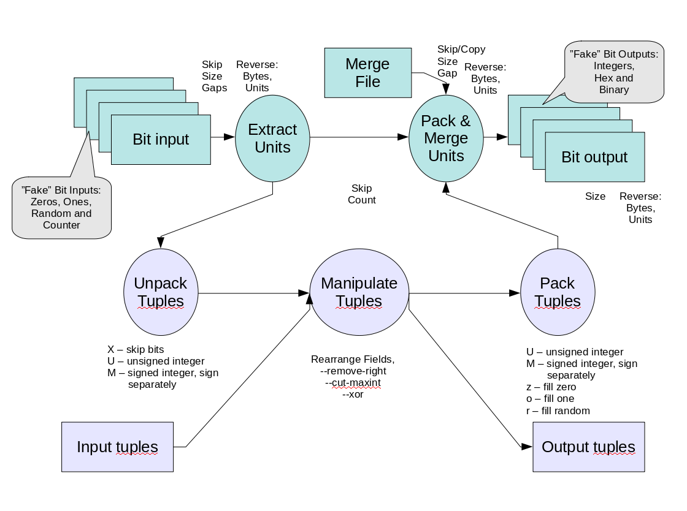

bdd
===

A command line tool to interpret, manipulate, merge and create bit
streams of any bit size with advanced bit field interpretation.

The program is one Python2 script, ./bdd.

Read bdd.1 and src/Presentation.odp to get more information how to use
the command.

# Some examples:

    bdd < foo > bar

Just copies file foo to bar, one byte at time.

    bdd --input-unit=3

Extracts 3-bit stream values from standard input and expands values
to bytes in standard output. If the file is not aligned to 3 bits,
the missing least significant bits for the last unit are zeros.

    bdd --input-unit=1 --output-pattern=1U1z

Output stream is input stream with zero added after every bit.
Four two-bit units are packed to one byte.

    bdd --input-pattern=8U8U --rearrange=1,0 --output-pattern=8U8U

Swap two consecutive bytes.

    echo -en '1,2,3\n3,7,7' | bdd --input-tuples --output-pattern='2U3U3U' | od -t o1

Build octal numbers from fields (prints 123 377)

    bdd --input-counter --count=16 --output-hex

Prints:

    00 01 02 03 04 05 06 07 08 09 0a 0b 0c 0d 0e 0f

The command:

    bdd --input-counter --count=16 --input-unit=12 --output-unit=12 --merge-file=/etc/passwd --output-hex

Prints first 16 bytes of /etc/passwd file as hex preceeded by a three-digit hex address of the byte:

    000 72 001 6f 002 6f 003 74 004 3a 005 78 006 3a 007 30
    008 3a 009 30 00a 3a 00b 72 00c 6f 00d 6f 00e 74 00f 3a

More readable documentation is generated with Makefile in src
directory. It generates:

- bdd.1 (Unix man format, original)
- bdd.1.html (generated)
- bdd.1.pdf (generated)
- Presentation.odf (original)
- Presentation.pdf (generated)
- bdd.html (generated pydoc file describing source code)

It also generates distribution files

- /tmp/bdd-dist/bdd.tar.bz2
- /tmp/bdd-dist/bdd.zip

Containing the source files and generated documentation.

To generate the documentation and distribution files, the following
tools are needed:

- libreoffice
- groff (with gropdf or pdfroff and post-grohtml)
- pydoc
- zip
- tar

/debian directory contains the configuration files needed to generate
debian package of the files. Debian archive generation is not yet
included in the Makefile and debian directory is not included in the
distribution archives.

You can run the tests with command

    sh test/test.sh
    
Unfortunately tests are not automated, they print results and text what 
result should be.
